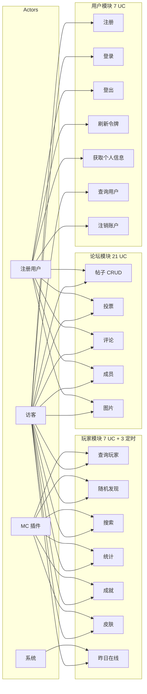

# Wofuf System Use Case Diagrams

> Generated from codebase analysis of Wofuf v0.0.1-SNAPSHOT
> Kotlin/Spring Boot DDD microservices platform for Minecraft server management

---

## 1. System Overview Use Case Diagram

This diagram presents the top-level view of the Wofuf system, showing all actors and primary use cases grouped by module boundary.

```mermaid
usecaseDiagram
    actor Visitor as "访客（未登录）"
    actor User as "注册用户"
    actor System as "系统（定时任务）"
    actor Plugin as "MC 插件 API"

    package "用户模块\nUsers Module" {
        UC_Register 注册
        UC_Login 登录
        UC_Logout 登出
        UC_RefreshToken 刷新令牌
        UC_GetCurrentUser 获取当前用户
        UC_GetUserByUsername 按用户名查询
        UC_DeleteUser 删除账户
    }

    package "玩家模块\nPlayers Module" {
        UC_GetPlayer 查询玩家资料
        UC_RandomPlayer 随机发现玩家
        UC_PlayerStats 查询玩家统计
        UC_PlayerAdvs 查询玩家成就
        UC_PlayerSkin 查询玩家皮肤
        UC_YesterdayOnline 昨日在线玩家
        UC_SearchPlayer 搜索玩家
        UC_CollectData 采集玩家数据
    }

    package "论坛模块\nForum Module" {
        UC_CreatePost 发布帖子
        UC_GetPost 查看帖子
        UC_EditPost 编辑帖子
        UC_DeletePost 删除帖子
        UC_VotePost 帖子投票
        UC_RecentPosts 最新帖子列表
        UC_PopularPosts 热门帖子列表
        UC_ReplyPost 回复帖子
        UC_ReplyComment 回复评论
        UC_GetComments 查看评论
        UC_VoteComment 评论投票
        UC_CreateMember 创建论坛成员
        UC_GetMember 查询论坛成员
        UC_UploadImage 上传图片
    }

    Visitor --> UC_Register
    Visitor --> UC_Login
    Visitor --> UC_GetPlayer
    Visitor --> UC_RandomPlayer
    Visitor --> UC_PlayerStats
    Visitor --> UC_PlayerAdvs
    Visitor --> UC_PlayerSkin
    Visitor --> UC_YesterdayOnline
    Visitor --> UC_SearchPlayer
    Visitor --> UC_RecentPosts
    Visitor --> UC_PopularPosts
    Visitor --> UC_GetPost
    Visitor --> UC_GetComments

    User --> UC_Logout
    User --> UC_RefreshToken
    User --> UC_GetCurrentUser
    User --> UC_DeleteUser
    User --> UC_CreatePost
    User --> UC_EditPost
    User --> UC_DeletePost
    User --> UC_VotePost
    User --> UC_ReplyPost
    User --> UC_ReplyComment
    User --> UC_VoteComment
    User --> UC_CreateMember
    User --> UC_GetMember
    User --> UC_UploadImage

    Plugin --> UC_CollectData
    System --> UC_CollectData
    System --> UC_YesterdayOnline
```

---

## 2. User Module Use Case Diagram (用户模块)

```mermaid
usecaseDiagram
    actor Visitor as "访客"
    actor AuthUser as "已认证用户"
    actor SelfUser as "账户本人"

    package "用户管理" {
        UC_Register 注册账户
        UC_Login 用户登录
        UC_Logout 用户登出
        UC_RefreshToken 刷新访问令牌
        UC_GetCurrentUser 获取个人信息
        UC_GetUserByUsername 按用户名查询用户
        UC_DeleteUser 注销账户
    }

    Visitor --> UC_Register : 提供邮箱/用户名/密码
    Visitor --> UC_Login : 提供用户名/密码

    UC_Login ..> UC_RefreshToken : 返回 refreshToken

    AuthUser --> UC_Logout : 携带 MeoKey
    AuthUser --> UC_RefreshToken : 携带 refreshToken
    AuthUser --> UC_GetCurrentUser : 携带 MeoKey
    AuthUser --> UC_GetUserByUsername : 提供用户名

    SelfUser --|> AuthUser
    SelfUser --> UC_DeleteUser : userId 必须匹配令牌

    UC_Register ..> UC_Login : 注册成功后自动引导

    note right of UC_Login
        返回:
        - userId
        - accessToken (JWT)
        - refreshToken
    end note

    note right of UC_DeleteUser
        安全限制:
        只能删除自己的账户
        userId 与令牌中的 userId 必须一致
    end note
```

### 2.1 User Module API Endpoints

| Use Case | Method | Path | Auth | Description |
|----------|--------|------|------|-------------|
| 注册账户 | POST | `/api/v1/users` | No | 注册新用户，返回 userId/username/email |
| 用户登录 | POST | `/api/v1/users/me/sessions` | No | 验证凭据，返回 JWT + refreshToken |
| 用户登出 | DELETE | `/api/v1/users/me/sessions` | Yes (MeoKey) | 将 JWT 加入 Redis 黑名单 |
| 刷新令牌 | POST | `/api/v1/users/me/tokens` | Yes (refreshToken) | 用 refreshToken 换取新的令牌对 |
| 获取个人信息 | GET | `/api/v1/users/me` | Yes (MeoKey) | 获取当前认证用户的完整资料 |
| 按用户名查询 | GET | `/api/v1/users/username/{username}` | Yes | 查询指定用户的公开信息 |
| 注销账户 | DELETE | `/api/v1/users/{userId}` | Yes (MeoKey, self) | 删除账户，仅限本人操作 |

---

## 3. Player Module Use Case Diagram (玩家模块)

```mermaid
usecaseDiagram
    actor Visitor as "访客"
    actor System as "系统"
    actor MCPlugin as "MC 插件 API"

    package "玩家数据查询" {
        UC_GetPlayer 查询玩家资料
        UC_RandomPlayer 随机发现玩家
        UC_SearchPlayer 搜索玩家
        UC_PlayerStats 查询玩家统计
        UC_PlayerAdvs 查询玩家成就
        UC_PlayerSkin 查询玩家皮肤
        UC_YesterdayOnline 昨日在线玩家
    }

    package "数据采集（后台）" {
        UC_CollectOnline 拉取在线玩家列表
        UC_CollectDetail 采集玩家详细数据
        UC_YesterdayCache 刷新昨日在线缓存
    }

    Visitor --> UC_GetPlayer : 玩家名或UUID
    Visitor --> UC_RandomPlayer : 可选数量
    Visitor --> UC_SearchPlayer : 搜索词 + 限制
    Visitor --> UC_PlayerStats : UUID + 过滤条件
    Visitor --> UC_PlayerAdvs : UUID + 是否含配方
    Visitor --> UC_PlayerSkin : UUID
    Visitor --> UC_YesterdayOnline

    MCPlugin --> UC_CollectOnline : GET /api/v1/players
    MCPlugin --> UC_CollectDetail : 玩家名/UUID

    UC_CollectOnline ..> UC_CollectDetail : 获取在线列表后逐个采集
    UC_CollectDetail ..> UC_GetPlayer : 创建或更新玩家

    System --> UC_CollectOnline : 每60秒
    System --> UC_YesterdayCache : 每日零点

    note right of UC_CollectDetail
        采集内容包括:
        - 统计数据 (Statistics)
        - 成就进度 (Advancements)
        - 皮肤数据 (Skin)
        使用冷却队列避免重复采集
    end note

    note left of UC_PlayerStats
        支持过滤:
        - category: 按分类
        - key: 按键名
        - categories[]/keys[]: 批量
    end note
```

### 3.1 Player Module API Endpoints

| Use Case | Method | Path | Auth | Description |
|----------|--------|------|------|-------------|
| 查询玩家资料 | GET | `/api/v1/players/playerNameOrUuid/{nameOrUuid}` | No | 按玩家名或UUID查询完整资料 |
| 随机发现玩家 | GET | `/api/v1/players/random-profile` | No | 获取随机玩家资料列表 |
| 搜索玩家 | GET | `/api/v1/players/search` | No | 按名称搜索玩家 |
| 查询玩家统计 | GET | `/api/v1/players/statistics/{uuid}` | No | 获取MC统计，支持分类/键过滤 |
| 查询玩家成就 | GET | `/api/v1/players/advancements/{uuid}` | No | 获取MC成就，可选排除配方 |
| 查询玩家皮肤 | GET | `/api/v1/players/skins/{uuid}` | No | 获取皮肤URL、披风、类型 |
| 昨日在线玩家 | GET | `/api/v1/players/yesterday` | No | 获取昨日在线玩家列表 |

### 3.2 Scheduled Tasks

| Task | Schedule | Description |
|------|----------|-------------|
| CollectOnlinePlayers | 每 60 秒 | 从 MC 插件 API 拉取在线玩家并采集数据 |
| PopCollectedPlayer | 每 600 秒 | 清理冷却队列中的过期玩家 |
| YesterdayOnlineRefresh | 每日 00:00 | 刷新"昨日在线"玩家缓存 |

---

## 4. Forum Module Use Case Diagram (论坛模块)

### 4.1 Posts & Voting (帖子与投票)

```mermaid
usecaseDiagram
    actor Visitor as "访客"
    actor Member as "论坛成员"

    package "帖子管理" {
        UC_CreatePost 发布帖子
        UC_GetPostBySlug 查看帖子
        UC_EditPost 编辑帖子
        UC_DeletePost 删除帖子
        UC_GetRecentPosts 浏览最新帖子
        UC_GetPopularPosts 浏览热门帖子
    }

    package "帖子投票" {
        UC_UpvotePost 赞成帖子
        UC_DownvotePost 反对帖子
        UC_UnvotePost 取消投票
    }

    Visitor --> UC_GetPostBySlug : 通过 slug 查看帖子
    Visitor --> UC_GetRecentPosts : 分页 + 分类过滤
    Visitor --> UC_GetPopularPosts : 分页 + 分类过滤

    Member --|> Visitor
    Member --> UC_CreatePost : 标题/正文/链接
    Member --> UC_EditPost : 只能编辑自己的帖子
    Member --> UC_DeletePost : 只能删除自己的帖子
    Member --> UC_UpvotePost : userId
    Member --> UC_DownvotePost : userId
    Member --> UC_UnvotePost : userId

    note right of UC_GetRecentPosts
        查询参数:
        - page: 页码 (默认1)
        - size: 每页数量 (默认10)
        - category: 分类过滤
        - userId: 包含投票状态
    end note

    note right of UC_GetPostBySlug
        查询参数:
        - userId: 可选，用于返回投票状态
    end note
```

### 4.2 Comments (评论)

```mermaid
usecaseDiagram
    actor Visitor as "访客"
    actor Member as "论坛成员"

    package "评论管理" {
        UC_ReplyPost 回复帖子
        UC_ReplyComment 回复评论
        UC_GetCommentById 查看评论
        UC_GetCommentsBySlug 查看帖子评论
        UC_UpvoteComment 赞成评论
        UC_DownvoteComment 反对评论
        UC_UpdateCommentStats 更新评论统计
    }

    Visitor --> UC_GetCommentById : 通过 commentId
    Visitor --> UC_GetCommentsBySlug : 通过 postSlug

    Member --|> Visitor
    Member --> UC_ReplyPost : postId + 评论内容
    Member --> UC_ReplyComment : commentId + postSlug + 评论内容
    Member --> UC_UpvoteComment : userId
    Member --> UC_DownvoteComment : userId

    note left of UC_ReplyComment
        嵌套回复:
        需要提供 commentId 和 postSlug
        支持无限层级评论
    end note

    note right of UC_UpdateCommentStats
        管理接口:
        手动刷新评论的投票数和回复数
    end note
```

### 4.3 Members & Images (成员与图片)

```mermaid
usecaseDiagram
    actor Member as "论坛成员"
    actor Visitor as "访客"

    package "论坛成员" {
        UC_CreateMember 创建论坛身份
        UC_GetCurrentMember 获取当前成员资料
        UC_GetMemberByUsername 按用户名查询成员
    }

    package "图片管理" {
        UC_UploadImage 上传图片
    }

    Member --> UC_CreateMember
    Member --> UC_GetCurrentMember : 携带 userId
    Member --> UC_GetMemberByUsername : 提供用户名
    Member --> UC_UploadImage : 文件 + 分类目录

    Visitor --> UC_GetMemberByUsername : 提供用户名

    note right of UC_CreateMember
        创建论坛成员身份:
        将用户账户关联到论坛模块
        一个用户对应一个论坛成员
    end note

    note right of UC_UploadImage
        上传参数:
        - file: MultipartFile
        - folder: 存储目录 (默认 "posts")
        图片存储到 MinIO
    end note
```

### 4.4 Forum Module API Endpoints

#### Posts

| Use Case | Method | Path | Auth | Description |
|----------|--------|------|------|-------------|
| 发布帖子 | POST | `/api/v1/forum/posts` | Yes | 创建新帖子 |
| 查看帖子 | GET | `/api/v1/forum/posts/slug/{slug}` | No | 按 slug 查看帖子详情 |
| 编辑帖子 | PUT | `/api/v1/forum/posts/{id}` | Yes | 编辑帖子标题/正文/链接 |
| 删除帖子 | DELETE | `/api/v1/forum/posts/{id}` | Yes | 删除帖子 |
| 赞成帖子 | PUT | `/api/v1/forum/posts/{id}/upvote` | Yes | 帖子 +1 |
| 反对帖子 | PUT | `/api/v1/forum/posts/{id}/downvote` | Yes | 帖子 -1 |
| 取消投票 | PUT | `/api/v1/forum/posts/{id}/unvote` | Yes | 撤销投票 |
| 最新帖子 | GET | `/api/v1/forum/posts/recent` | No | 分页列表，支持分类 |
| 热门帖子 | GET | `/api/v1/forum/posts/popular` | No | 按热度排序 |

#### Comments

| Use Case | Method | Path | Auth | Description |
|----------|--------|------|------|-------------|
| 回复帖子 | POST | `/api/v1/forum/posts/{id}/replies` | Yes | 对帖子发表评论 |
| 按slug回复 | POST | `/api/v1/forum/posts/slug/{slug}/replies` | Yes | 同上，通过 slug |
| 回复评论 | POST | `/api/v1/forum/comments/{id}/replies` | Yes | 嵌套回复 |
| 查看评论 | GET | `/api/v1/forum/comments/{id}` | No | 单条评论 |
| 帖子评论列表 | GET | `/api/v1/forum/posts/slug/{slug}/comments` | No | 帖子全部评论 |
| 赞成评论 | PUT | `/api/v1/forum/comments/{id}/upvote` | Yes | 评论 +1 |
| 反对评论 | PUT | `/api/v1/forum/comments/{id}/downvote` | Yes | 评论 -1 |
| 更新统计 | PUT | `/api/v1/forum/comments/{id}/stats` | Yes | 手动刷新统计 |

#### Members & Images

| Use Case | Method | Path | Auth | Description |
|----------|--------|------|------|-------------|
| 创建成员 | POST | `/api/v1/forum/members` | Yes | 创建论坛身份 |
| 当前成员 | GET | `/api/v1/forum/members/current` | Yes | 获取自己资料 |
| 按用户名查询 | GET | `/api/v1/forum/members/username/{name}` | No | 查看他人资料 |
| 上传图片 | POST | `/api/v1/forum/images/upload` | Yes | 上传图片到 MinIO |

---

## 5. Actor-Use Case Matrix



---

## 6. Use Case Includes/Extends Relationships

```mermaid
usecaseDiagram
    actor User as "注册用户"

    UC_CreatePost 发布帖子
    UC_ReplyPost 回复帖子
    UC_VotePost 帖子投票
    UC_GetPostBySlug 查看帖子
    UC_GetCommentsBySlug 查看帖子评论
    UC_AuthCheck 身份验证
    UC_OwnershipCheck 权属校验
    UC_GetCurrentMember 获取论坛成员

    User --> UC_CreatePost
    User --> UC_ReplyPost
    User --> UC_VotePost
    User --> UC_GetPostBySlug

    UC_CreatePost .> UC_AuthCheck : <<include>>
    UC_CreatePost .> UC_GetCurrentMember : <<include>>
    UC_ReplyPost .> UC_AuthCheck : <<include>>
    UC_ReplyPost .> UC_GetCurrentMember : <<include>>
    UC_VotePost .> UC_AuthCheck : <<include>>

    UC_GetPostBySlug .> UC_GetCommentsBySlug : <<extend>>

    UC_EditPost ..> UC_OwnershipCheck : <<include>>
    UC_DeletePost ..> UC_OwnershipCheck : <<include>>

    note right of UC_AuthCheck
        通过 MeoKey (JWT) 头部
        验证用户身份
    end note
```

---

## 7. Statistics Summary

| Module | Controllers | Use Cases | Scheduled Tasks | Event Handlers |
|--------|-------------|-----------|-----------------|----------------|
| **Users** | 7 | 7 | 0 | 1 |
| **Players** | 7 | 7 (+1 background) | 3 | 0 |
| **Forum** | 22 | 21 | 0 | 0 |
| **Total** | **36** | **35** | **3** | **1** |

### Actor Distribution

| Actor | Accessible Use Cases |
|-------|---------------------|
| 访客 (Visitor) | 14 |
| 注册用户 (Authenticated User) | 19 |
| 系统 (Scheduled Tasks) | 3 |
| MC 插件 API | 1 (data provider) |

### Auth Requirements

| Auth Level | Endpoints Count |
|-----------|----------------|
| Public (No Auth) | 14 |
| Required (MeoKey) | 15 |
| Required (Self-only) | 1 |
| Required (RefreshToken) | 1 |
| **Total** | **31** |
